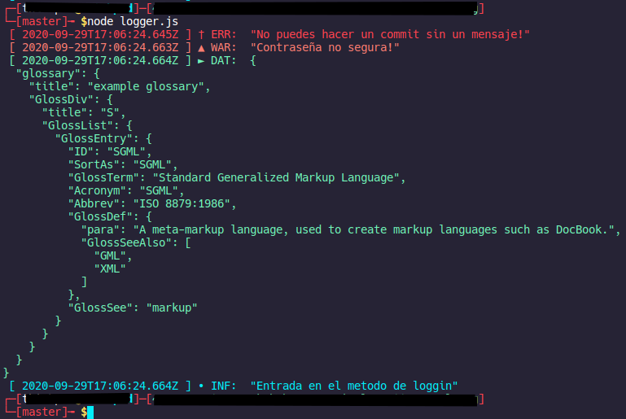

# Simple Pretty console.log

Just a simple js file for make the console.log a bit more colorfull and readable on the browser.

## Config
```diff
+ Now you have a config.json file!
```
The config file has:

- minimumLevelLog: is used to specify how much level of console log you want to show, being right now:
  - [0] Error: Pretty staightforward, something blowed up.
  - [1] Warning: Just tell you that might be something problematic.
  - [2] Data: For visualize objects and stuff.
  - [3] Info: Inform you were is going the flow of the execution.
- dateIso: Indicates if you want the date to be display in ISO format or default format, being default like this: [ 29-9-2020 16:40:23 ]

```json
{
	"minimumLevelLog": 3,
	"dateIso": true,
	"0": {
		"frontStyle": "color: red; font-weight: bold;",
		"header": "[ ##DATE## ] † ERROR: ",
		"nodeFontColor": "[31m"
	},
	"1": {
		"frontStyle": "color: orange; font-weight: bold;",
		"header": "[ ##DATE## ] ▲ WARNING: ",
		"nodeFontColor": "[33m"
	},
	"2": {
		"frontStyle": "color: lightgreen; font-weight: bold;",
		"header": "[ ##DATE## ] ► DATA: ",
		"nodeFontColor": "[32m"
	},
	"3": {
		"frontStyle": "color: lightblue; font-weight: bold;",
		"header": "[ ##DATE## ] • INFo: ",
		"nodeFontColor": "[34m"
	}
}
```

## Usage
Import the module and just type ``` logger(0, "Happy litle error!"); ```

Just download the js file, place it on your project and import the file in your js files like this:
```
 import logger from '<YOUR PATH>/logger.js';
```
and the way of use it is like this:
```js
logger(0, "No puedes hacer un commit sin un mensaje!");
logger(1, "Contraseña no segura!");
logger(2, jsonObj);
logger(3, "Entrada en el metodo de loggin");
```
This will be the output on the browser:


And this will be the output on the terminal:



hope this is useful for someone.
