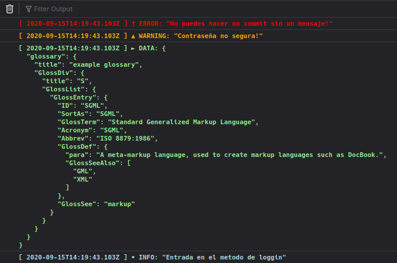

# Simple Pretty console.log

Just a simple js file for make the console.log a bit more colorfull and readable on the browser.

## Config
For the moment the config is in the same js file.

- minimumLevelLog: is used to specify how much level of console log you want to show, being right now:
  - [0] Error: Pretty staightforward, something blowed up.
  - [1] Warning: Just tell you that might be something problematic.
  - [2] Data: For visualize objects and stuff.
  - [3] Info: Inform you were is going the flow of the execution.

And the config object is something like that:
```
{
  0: {
    style: "color: red; font-weight: bold;",
    header: "[ " + date.toISOString() + " ] † ERROR: ",
  },
  1: {
    style: "color: orange; font-weight: bold;",
    header: "[ " + date.toISOString() + " ] ▲ WARNING: ",
  },
  2: {
    style: "color: lightgreen; font-weight: bold;",
    header: "[ " + date.toISOString() + " ] ► DATA: ",
  },
  3: {
    style: "color: lightblue; font-weight: bold;",
    header: "[ " + date.toISOString() + " ] • INFO: ",
  },
}
```

## Usage

### IMPORTANT 
```diff
# The new version changed the way manages the call to logger.
- logger({ type: 0, msg: "Happy litle error!" });
# Changed to 
+ logger(0, "Happy litle error!");
```

Just download the js file, place it on your project and import the file in your js files like this:
```
 import logger from '<YOUR PATH>/logger.js';
```
and the way of use it is like this:
```js
logger(0, "No puedes hacer un commit sin un mensaje!");
logger(1, "Contraseña no segura!");
logger(2, jsonObj);
logger(3, "Entrada en el metodo de loggin");
```
And this will be the output:



hope this is useful for someone.
